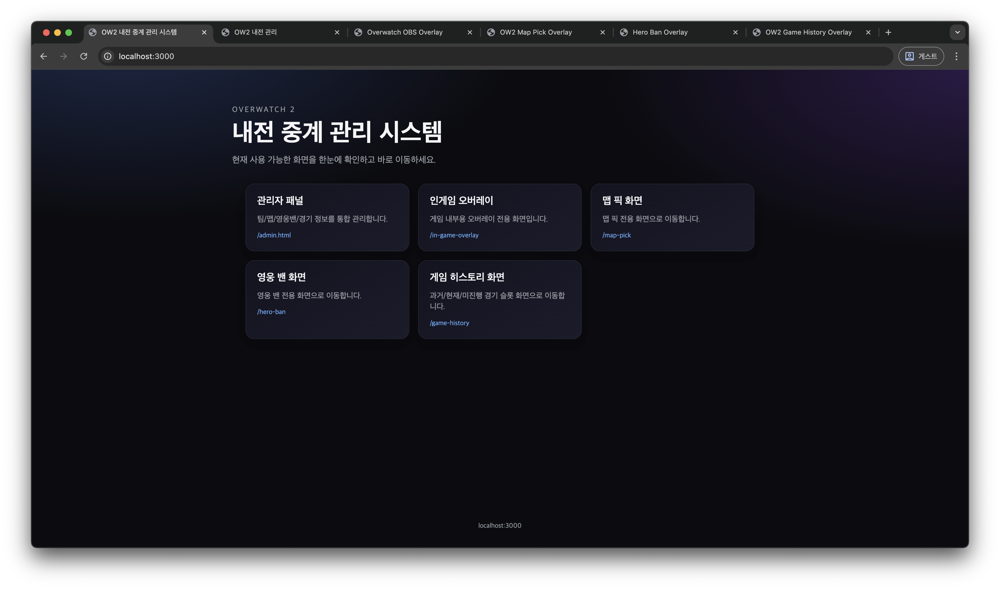
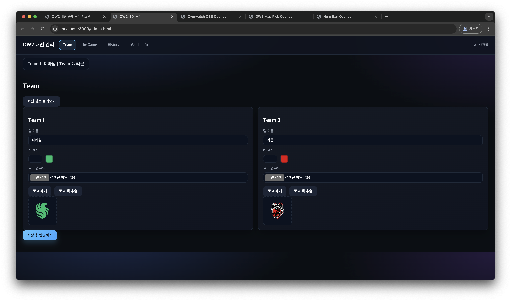
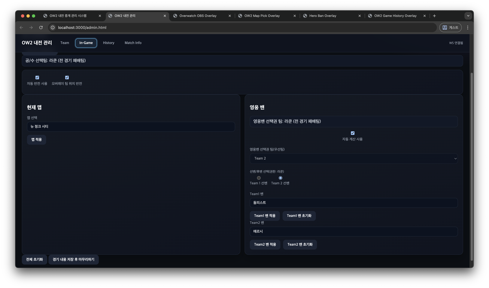
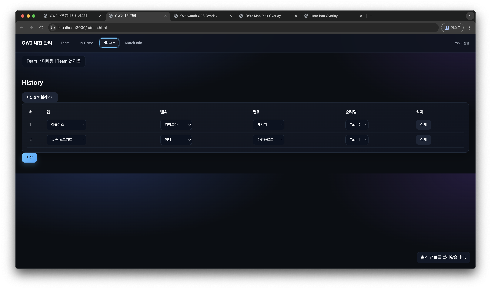
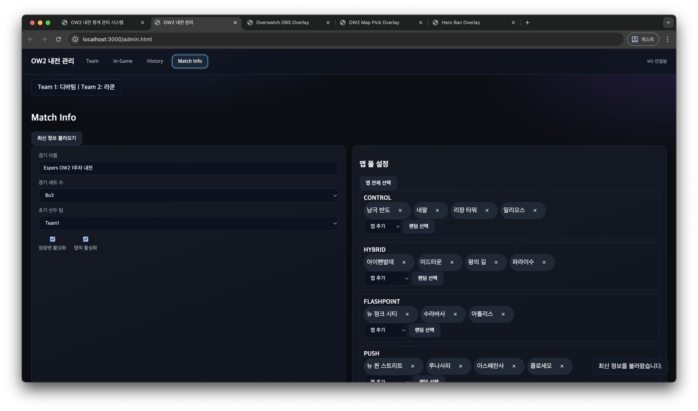
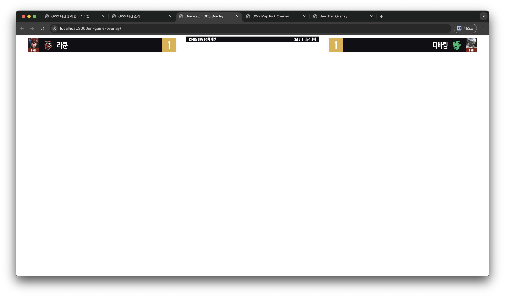

# 오버워치 내전 중계 관리 시스템

내전 진행에 필요한 **팀/맵/영웅밴/오버레이** 화면을 한곳에서 관리하는 웹 기반 중계 관리 시스템입니다.  
관리자 패널에서 상태를 변경하면 WebSocket을 통해 오버레이/보조 화면이 즉시 동기화됩니다.

---

## 1) 프로젝트 개요

이 프로젝트는 다음 목적에 맞춰 구성되어 있습니다.

- 팀 정보(팀명/로고/컬러) 관리
- 맵 풀 기반 맵 픽 진행
- 시리즈 규칙 기반 영웅 밴 진행
- 세트 결과 누적 및 히스토리 관리
- 인게임 오버레이 실시간 반영

주요 사용 시나리오:

1. 관리자가 `/admin.html`에서 팀/매치/인게임 상태를 설정
2. 서버가 규칙 검증 후 상태를 저장
3. 오버레이 화면(`/in-game-overlay`, `/hero-ban`, `/map-pick`)에 즉시 반영

---

## 2) 기술 스택

- Runtime: Node.js
- Server: Express
- Realtime: ws(WebSocket)
- Image 처리: sharp
- 데이터 저장: JSON 파일 기반(`data/`)

`package.json` 기준 실행 스크립트:

```bash
npm start
```

---

## 3) 주요 기능 정리

### A. 팀/매치 관리
- 팀1/팀2 이름, 로고, 컬러 설정
- 시리즈 형식(Bo3/Bo5/Bo7) 및 선선택권 팀 지정
- 영웅밴/맵픽 활성화 토글

### B. 맵 픽 규칙
- 모드별 맵 풀에서만 선택 가능
- 동일 모드 내 맵 재사용 제한(풀 소진 전 재사용 금지)
- 모드 순환 규칙(순환 완료 전 동일 모드 반복 제한)

### C. 영웅 밴 규칙
- 존재하지 않는 영웅 밴 금지
- 양 팀 동일 영웅 동시 밴 금지
- 역할군 중복 밴 제한
- 우선팀/선밴 순서 검증
- 시리즈 누적 히스토리 기반 밴 검증

### D. 인게임 오버레이
- 팀명/로고/스코어/맵/밴 영웅 표시
- 레이아웃 스왑 자동/수동 제어
- 밴 카드 및 아이콘 반영

### E. 히스토리
- 세트 결과 누적 저장
- 과거 맵/밴/승자 기록 관리
- 현재 진행 상태와 히스토리 연동

---

## 4) 화면 구성 (스크린샷)

`example_image/` 폴더의 이미지를 모두 포함합니다.

### 메인


### 관리자 - 팀 관리


### 관리자 - 인게임 설정


### 관리자 - 히스토리 관리


### 관리자 - 매치 정보


### 맵 픽 화면


### 영웅 밴 화면


### 인게임 오버레이 화면


### 게임 히스토리 화면


---

## 5) 실행 방법

### 설치
```bash
npm install
```

### 실행
```bash
npm start
```

기본 실행 주소:

- 메인: http://localhost:3000/
- 관리자: http://localhost:3000/admin.html
- 맵 픽: http://localhost:3000/map-pick
- 영웅 밴: http://localhost:3000/hero-ban
- 인게임 오버레이: http://localhost:3000/in-game-overlay
- 게임 히스토리: http://localhost:3000/game-history

### 영웅 영상 에셋 안내

- `video/hero` 대용량 영상 파일은 저장소에 직접 포함하지 않을 수 있습니다.
- 영웅 영상 에셋은 GitHub Releases의 `v1.0.0` 릴리즈를 참고해 다운로드/적용해주세요.

### 같은 와이파이의 다른 기기에서 접속하기

1. 서버 실행

```bash
npm start
```

2. 터미널에 출력되는 `LAN access: http://<내IP>:3000` 주소 확인
3. 같은 와이파이에 연결된 다른 기기 브라우저에서 해당 주소 접속

문제가 있을 때 확인:

- macOS 방화벽에서 Node.js 허용 여부
- 두 기기가 동일한 공유기/SSID에 연결되어 있는지
- 공유기/AP의 클라이언트 간 통신 차단(격리) 설정 여부

---

## 6) 폴더 구조(핵심)

```text
data/                 # 상태 저장(JSON)
  history.json
  settings.json
  state.json
  teams.json

public/               # 사용자 화면
  admin.html
  map-pick.html
  hero-ban.html
  overlay.html
  game-history.html
  js/admin/...        # 관리자 기능 모듈

src/                  # 서버 공통 로직
  assets.js
  rules.js            # 맵픽/영웅밴 검증 규칙
  storage.js

img/, video/          # 영웅/맵 리소스
server.js             # Express + WebSocket 서버
```

---

## 7) 데이터 파일 설명

`data/settings.json`
- 매치 기본 설정(시리즈, 토글, 맵 풀 등)

`data/teams.json`
- 팀명/컬러/로고

`data/state.json`
- 현재 진행 중 세트 상태(맵, 사이드, 밴, 우선권 메타 등)

`data/history.json`
- 완료된 세트 기록(맵, 밴, 승자)

---

## 8) 서버 동작 요약

- REST API로 설정/상태/히스토리 조회 및 저장
- WebSocket `admin:publish`로 관리자 변경사항 수신
- 서버에서 규칙 검증 후 저장
- `overlay:update` 브로드캐스트로 모든 뷰 실시간 갱신

---

## 9) 사용 흐름 추천

1. 관리자에서 팀/매치 설정 완료
2. 맵 픽 및 영웅 밴 진행
3. 경기 종료 시 승자 확정 및 히스토리 저장
4. 다음 세트로 자동 인덱스 증가 후 반복

---

## 10) 참고

- 이 프로젝트는 DB 대신 JSON 파일 저장 방식을 사용하므로, 단일 운영 환경에서 빠르게 운용하기 좋습니다.
- 방송/중계 환경에서 사용할 경우, 서버 프로세스 안정성(예: pm2)과 데이터 백업 정책을 함께 구성하는 것을 권장합니다.
