# OWScrimDesk

> 🎮 Overwatch 내전에 필요한 **팀 / 맵 / 영웅 밴 / 오버레이** 화면을 하나의 관리자 패널에서 통합 제어하는 웹 기반 중계 시스템

OWScrimDesk는 관리자 패널에서 상태를 변경하면 WebSocket을 통해 오버레이와 보조 화면이 즉시 동기화됩니다.  
빠른 세팅, 실시간 반영, JSON 기반 간단한 운영을 목표로 만든 프로젝트입니다.

## ✨ Highlights

- 🧭 관리자 화면에서 경기 진행 상태를 한 번에 관리
- ⚡ WebSocket 기반 실시간 오버레이 동기화
- 🗺️ 맵 픽 / 🚫 영웅 밴 규칙 검증 내장
- 🎨 팀 로고 대표 색상 자동 추출
- 🧾 세트 히스토리 누적 및 다음 세트 계산 지원
- 📺 인터미션 / 대기실 / 매치 시작 / 미리보기 화면 제공

---

## 1) 📌 프로젝트 개요

이 프로젝트는 다음 목적에 맞춰 구성되어 있습니다.

- 팀 정보(팀명/로고/컬러) 관리
- 맵 풀 기반 맵 픽 진행
- 시리즈 규칙 기반 영웅 밴 진행
- 세트 결과 누적 및 히스토리 관리
- 인게임 오버레이 실시간 반영
- 인터미션(휴식 화면) 콘텐츠 관리
- 선수 명단 및 대회 정보 관리

주요 사용 시나리오:

1. 관리자가 `/admin.html`에서 팀/매치/인게임 상태를 설정
2. 서버가 규칙 검증 후 상태를 저장
3. 오버레이 화면(`/in-game-overlay`, `/hero-ban`, `/map-pick`)에 즉시 반영

---

## 2) 🛠️ 기술 스택

- **Runtime**: Node.js
- **Server**: Express
- **Realtime**: ws (WebSocket)
- **Image 처리**: sharp (대표 색상 추출 포함)
- **HTML 파싱**: jsdom
- **HTTP 클라이언트**: axios
- **타입 검사**: TypeScript (`tsc --noEmit`, JSDoc 기반)
- **데이터 저장**: JSON 파일 기반 (`data/`)

`package.json` 기준 실행 스크립트:

```bash
npm start        # 서버 실행
npm run typecheck  # 타입 검사
```

---

## 3) 🚀 주요 기능 정리

### A. 👥 팀/매치 관리
- 팀1/팀2 이름, 로고, 컬러 설정
- 로고 이미지에서 대표 색상 자동 추출 (sharp 기반)
- 시리즈 형식(Bo1/Bo3/Bo5) 및 선택권 팀 지정
- 영웅밴/맵픽 활성화 토글

### B. 🗺️ 맵 픽 규칙
- 모드별 맵 풀(control / hybrid / flashpoint / push / escort)에서만 선택 가능
- 동일 모드 내 맵 재사용 제한 (풀 소진 전 재사용 금지)
- 모드 순환 규칙 (순환 완료 전 동일 모드 반복 제한)

### C. 🚫 영웅 밴 규칙
- 존재하지 않는 영웅 밴 금지 (에셋 스캔 기반 검증)
- 양 팀 동일 영웅 동시 밴 금지
- 시리즈 내 동일 팀이 같은 영웅 2번 밴 금지
- 동일 역할군 양 팀 동시 밴 제한
- 우선팀/선밴 순서 검증

### D. 🎥 인게임 오버레이
- 팀명/로고/스코어/맵/밴 영웅 표시
- 공격/수비 사이드 표시
- 레이아웃 스왑 자동/수동 제어 (공격팀 위치 기준)
- 밴 카드 및 영웅 아이콘 반영

### E. 🧾 히스토리
- 세트 결과(맵, 밴, 승자) 누적 저장
- 과거 기록 기반 다음 세트 밴/사이드 우선권 자동 계산
- 현재 진행 상태와 히스토리 연동

### F. 🎛️ 인터미션 & 기타 설정 (ETC 탭)
- 스폰서/대회 이름/로고 설정
- YouTube 영상 또는 이미지 기반 인터미션 콘텐츠 목록 관리
- YouTube 영상 길이 자동 조회 및 휴식 타이머 설정
- 선수 명단(이름/포지션/주 영웅/티어) 설정

---

## 4) 🖼️ 화면 구성 (스크린샷)

`docs/example_image/` 폴더의 이미지를 모두 포함합니다.

### 메인
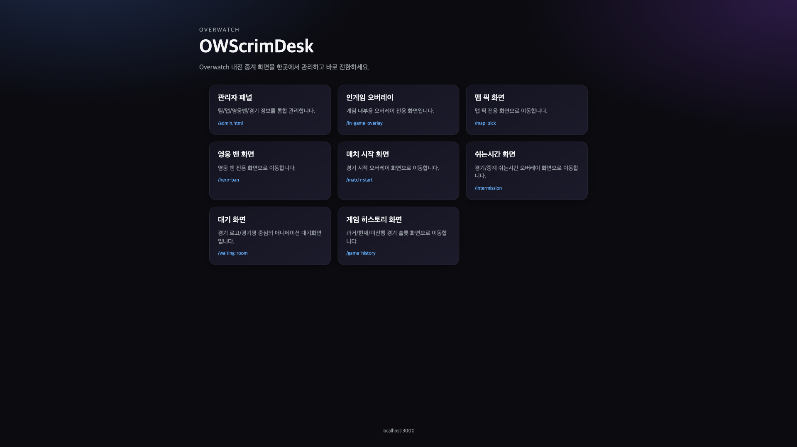

### 관리자 - 팀 관리
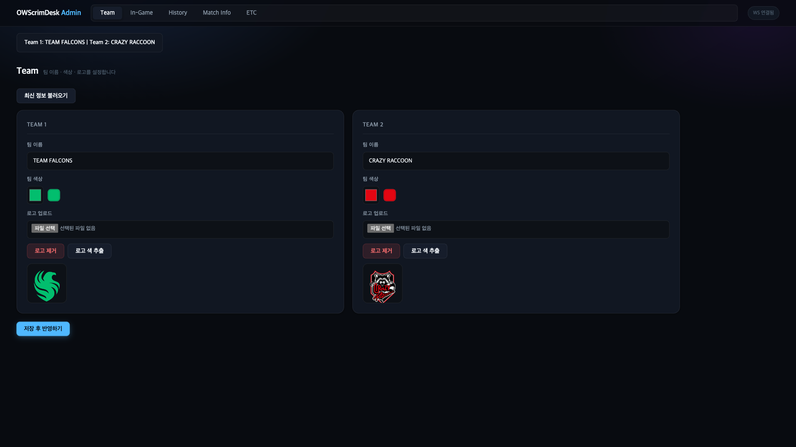

### 관리자 - 인게임 설정
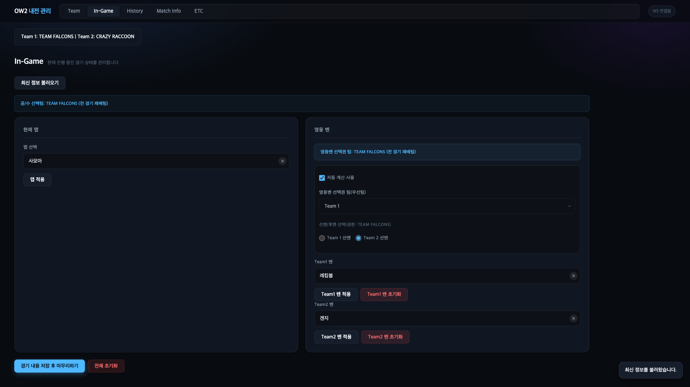

### 관리자 - 히스토리 관리
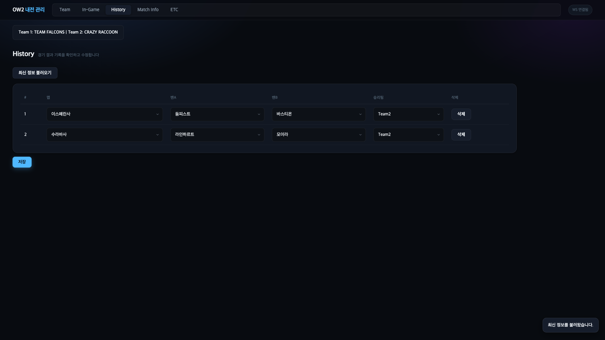

### 관리자 - 매치 정보
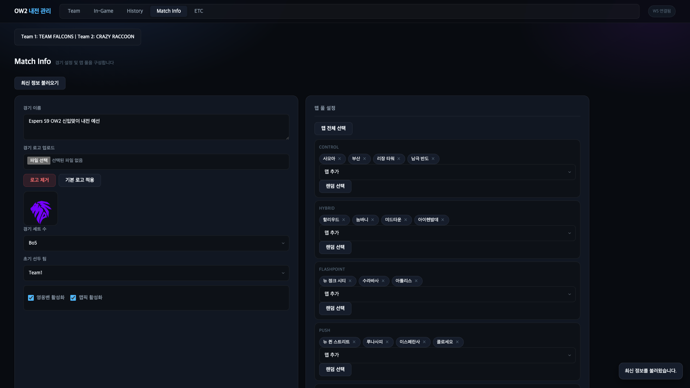

### 관리자 - ETC 설정
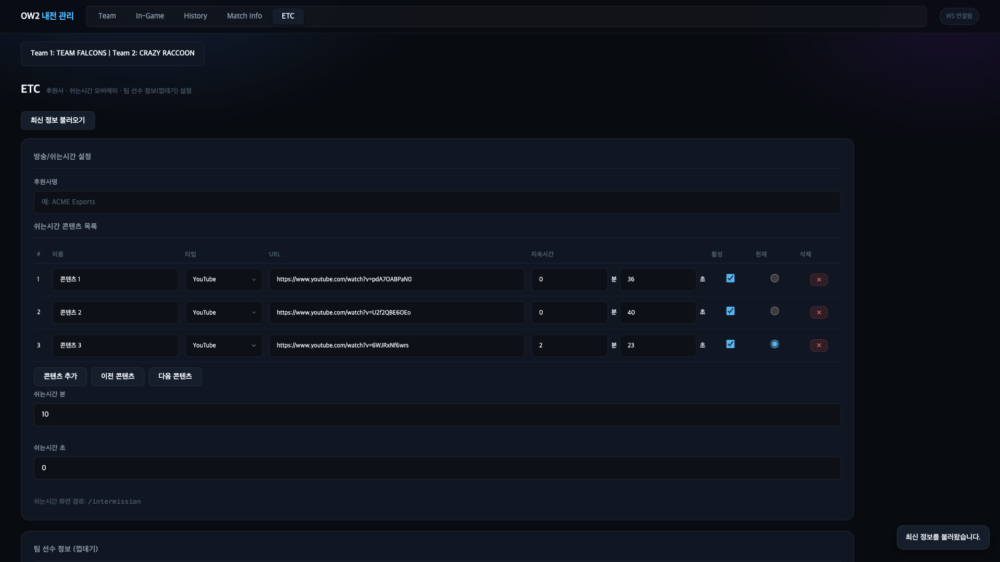

### 맵 픽 화면
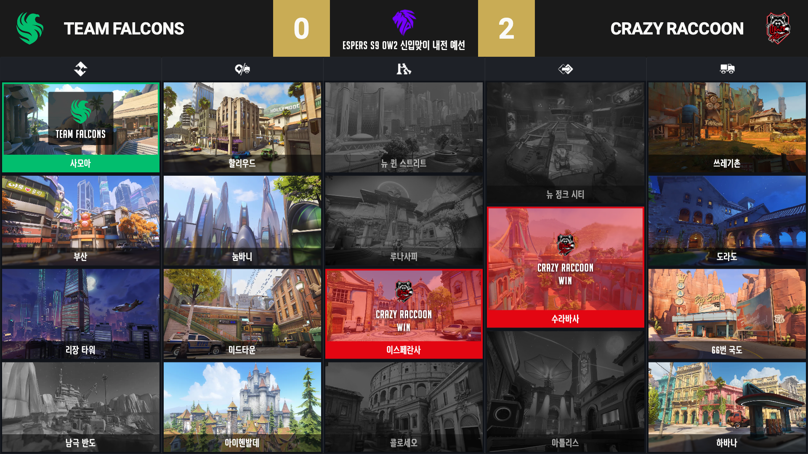

### 영웅 밴 화면
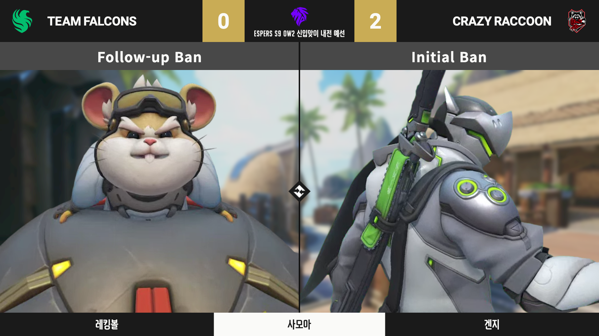

### 인게임 오버레이 화면
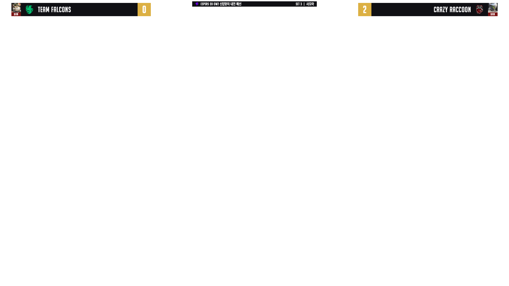

### 게임 히스토리 화면
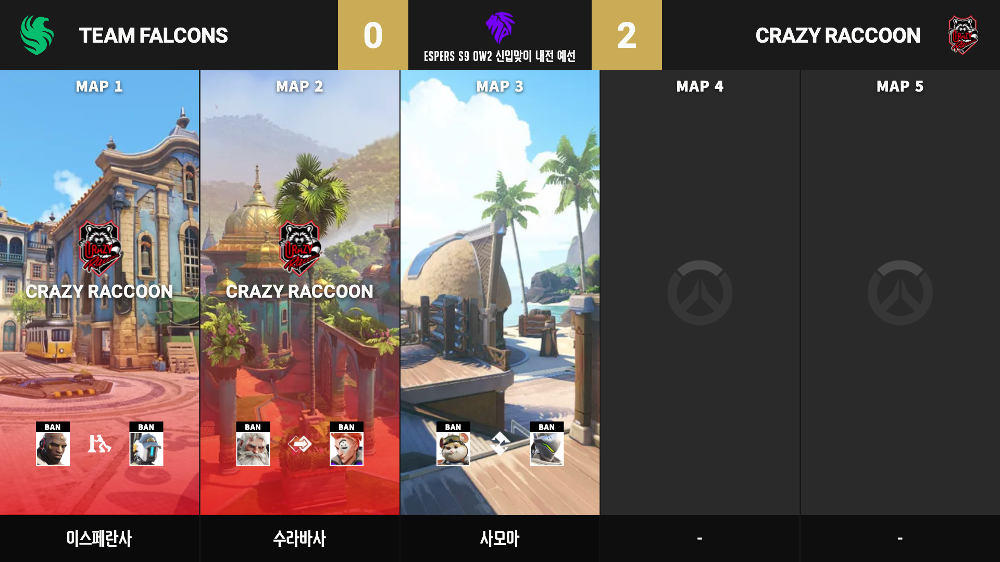

### 매치 시작 화면
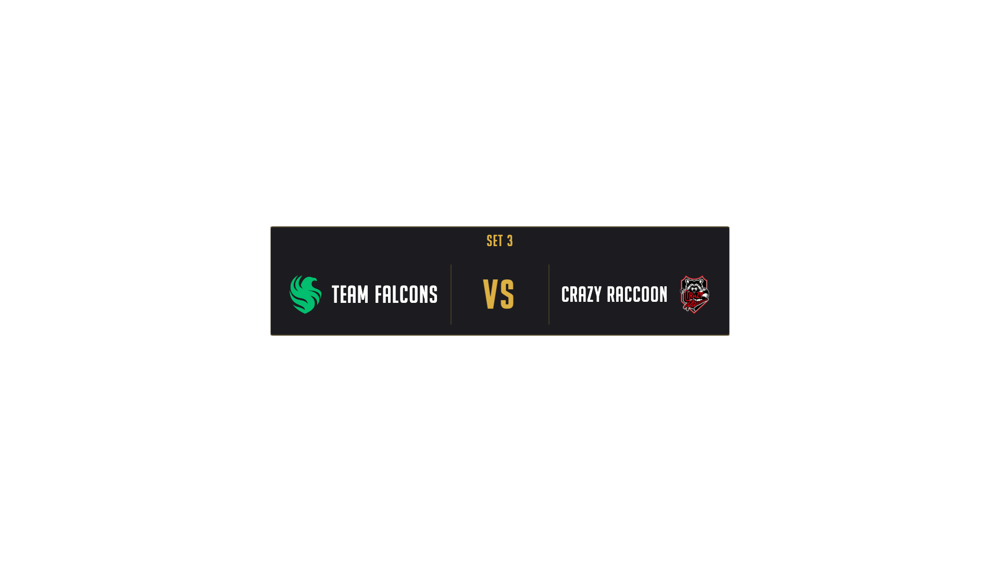

### 인터미션 화면
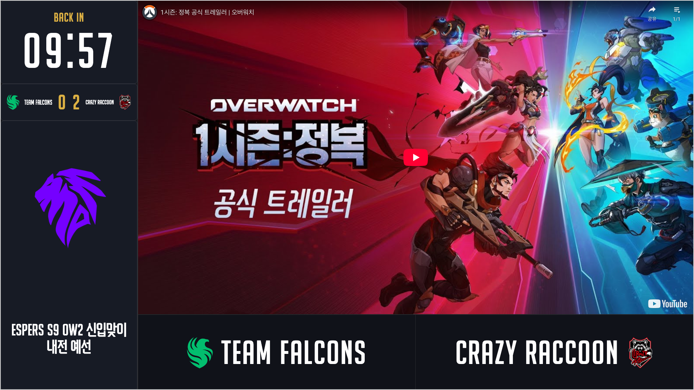

### 대기실 화면
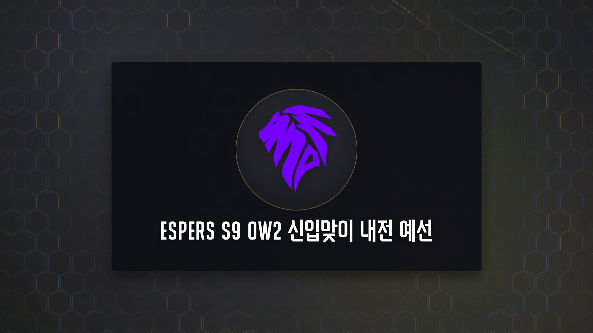

### 미리보기 화면
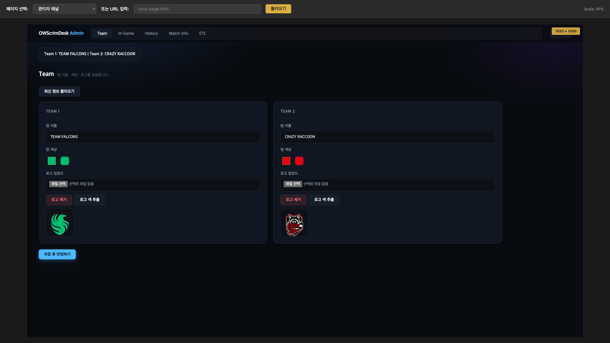

---

## 5) ▶️ 실행 방법

### 설치
```bash
npm install
```

### 실행

포트를 지정해 실행하려면 `PORT` 환경변수를 설정합니다.  
지정하지 않으면 OS가 자동으로 빈 포트를 할당하며, 실제 포트는 터미널 출력에서 확인할 수 있습니다.

```bash
PORT=3000 npm start
```

실행 후 터미널에 출력된 주소를 확인합니다.

```
Server running at http://localhost:3000
```

기본 화면 주소 (포트 3000 기준):

| 화면 | 주소 |
|------|------|
| 메인 | http://localhost:3000/ |
| 관리자 | http://localhost:3000/admin.html |
| 맵 픽 | http://localhost:3000/map-pick |
| 영웅 밴 | http://localhost:3000/hero-ban |
| 인게임 오버레이 | http://localhost:3000/in-game-overlay |
| 게임 히스토리 | http://localhost:3000/game-history |
| 매치 시작 | http://localhost:3000/match-start |
| 인터미션 | http://localhost:3000/intermission |
| 대기실 | http://localhost:3000/waiting-room |
| 미리보기 | http://localhost:3000/preview |

### 🎬 영웅 영상 에셋 안내

- `video/hero` 대용량 영상 파일은 저장소에 직접 포함하지 않을 수 있습니다.
- 영웅 영상 에셋은 GitHub Releases의 `v1.0.0` 릴리즈를 참고해 다운로드/적용해주세요.

### 🌐 같은 와이파이의 다른 기기에서 접속하기

기본적으로 LAN IP 출력이 비활성화(`IS_LAN_ACCESSIBLE = false`)되어 있습니다.  
LAN 접근을 활성화하려면 `app/backend/bootstrap/server.js`에서 아래 값을 변경합니다.

```js
const IS_LAN_ACCESSIBLE = true;  // false → true 로 변경
```

이후 서버 재실행 시 터미널에 LAN 주소가 함께 출력됩니다.

```
Server running at http://localhost:3000
LAN access: http://192.168.x.x:3000
```

문제가 있을 때 확인:

- macOS 방화벽에서 Node.js 허용 여부
- 두 기기가 동일한 공유기/SSID에 연결되어 있는지
- 공유기/AP의 클라이언트 간 통신 차단(격리) 설정 여부

---

## 6) 🗂️ 폴더 구조(핵심)

```text
data/                 # 상태 저장(JSON)
  history.json          ← 완료된 세트 기록
  settings.json         ← 매치 기본 설정
  state.json            ← 현재 진행 세트 상태
  teams.json            ← 팀 정보

app/
  backend/
    bootstrap/          # 서버 조립(DI) / 경로 상수
    platform/           # HTTP 라우트 / WS / JSON persistence
    modules/            # match / overlay / teams / assets 도메인
    shared/             # 공용 계약(schemas, types) / 파일 유틸
  frontend/
    public/
      admin.html
      map-pick.html
      hero-ban.html
      overlay.html
      game-history.html
      match-start.html
      intermission.html
      waiting-room.html
      preview.html
      js/
        admin/
          app/          # 관리자 엔트리
          core/         # 공용 UI/네트워크/상태
          features/     # 기능별 모듈 (team/match/ingame/history/etc)

img/                  # 맵·영웅 이미지 에셋 (런타임 스캔)
  maps/               # 모드별 폴더 (쟁탈/하이브리드/플래시포인트/밀기/호위)
  hero/               # 역할군별 폴더 (돌격/공격/지원)
  icon/               # 기타 아이콘

video/                # 영웅 등장 영상 에셋 (대용량, 별도 배포)
  hero/

docs/                 # 예제 이미지 / 개발 가이드 / 보관용 문서
server.js             # 루트 실행 엔트리
```

---

## 7) 💾 데이터 파일 설명

### `data/settings.json`
매치 기본 설정 (시리즈, 토글, 맵 풀, 인터미션 콘텐츠, 선수 명단 등)

```json
{
  "matchName": "대회명",
  "series": "Bo3",
  "firstPickTeamId": "team1",
  "enableHeroBan": true,
  "enableMapPick": true,
  "mapPool": {
    "control": [],
    "hybrid": [],
    "flashpoint": [],
    "push": [],
    "escort": []
  },
  "etc": {
    "sponsor": "",
    "breakContentType": "youtube",
    "breakContents": [
      { "id": "content-1", "title": "...", "type": "youtube", "url": "...", "durationSeconds": 30, "enabled": true }
    ],
    "breakMinutes": 10,
    "breakSeconds": 0,
    "players": {
      "team1": [{ "name": "", "position": "", "mainHero": "", "tier": "" }],
      "team2": []
    }
  }
}
```

### `data/teams.json`
팀명 / 컬러 / 로고(Base64 또는 경로)

### `data/state.json`
현재 진행 중인 세트 상태 (맵, 사이드, 밴, 우선권 메타 등)  
저장 후 `meta.js`에 의해 파생 값(`sidePickOwner`, `banOrder`, `attackTeam`, `layoutSwap` 등)이 자동 재계산됩니다.

### `data/history.json`
완료된 세트 기록 배열 (맵, 밴, 승자)

---

## 8) 🔌 REST API 엔드포인트

| 메서드 | 경로 | 설명 |
|--------|------|------|
| `GET` | `/api/settings` | 설정 조회 |
| `POST` | `/api/settings` | 설정 저장 |
| `GET` | `/api/teams` | 팀 정보 조회 |
| `POST` | `/api/teams` | 팀 정보 저장 |
| `POST` | `/api/teams/dominant-color` | 로고 이미지 대표 색상 추출 |
| `GET` | `/api/state` | 현재 경기 상태 조회 (메타 재계산 포함) |
| `GET` | `/api/history` | 경기 히스토리 조회 |
| `POST` | `/api/history` | 히스토리 저장 |
| `GET` | `/api/overlay/snapshot` | 오버레이 전체 스냅샷 조회 |
| `GET` | `/api/assets/maps` | 맵 에셋 목록 (`img/maps/` 스캔) |
| `GET` | `/api/assets/heroes` | 영웅 에셋 목록 (`img/hero/` 스캔) |
| `GET` | `/api/youtube/duration?videoId=` | YouTube 영상 길이 조회 (초 단위) |

---

## 9) 📡 WebSocket 이벤트

연결 주소는 서버와 동일한 포트입니다.

| 방향 | 이벤트 | 설명 |
|------|--------|------|
| Client → Server | `overlay:hello` | 초기 접속 시 현재 오버레이 스냅샷 수신 요청 |
| Client → Server | `admin:publish` | 경기 상태 publish (서버 규칙 검증 후 전체 브로드캐스트) |
| Server → Client | `overlay:update` | 오버레이 전체 상태 브로드캐스트 (전 클라이언트 대상) |
| Server → Client | `admin:ok` | publish 성공 응답 |
| Server → Client | `admin:error` | publish 실패 에러 메시지 |

`admin:publish` payload 구조:

```json
{
  "settings": { },
  "teams": { },
  "state": { },
  "history": [],
  "context": "ingame",
  "reset": false,
  "skipHeroBan": false,
  "skipMapPick": false,
  "gameIndex": 1
}
```

---

## 10) ⚙️ 서버 동작 요약

- REST API로 설정/상태/히스토리 조회 및 저장
- WebSocket `admin:publish`로 관리자 변경사항 수신
- 서버에서 규칙 검증 (`rules.js`) 후 저장
- `meta.js`로 파생 값 자동 재계산 (사이드 우선권, 밴 순서, 공격팀, 레이아웃 스왑)
- `overlay:update` 브로드캐스트로 모든 뷰 실시간 갱신
- 파일 저장은 `.tmp` 임시본 생성 후 `rename` 방식의 원자적 쓰기로 손상 방지

---

## 11) 🧪 사용 흐름 추천

1. 관리자에서 팀/매치 설정 완료
2. 맵 픽 및 영웅 밴 진행
3. 경기 종료 시 승자 확정 및 히스토리 저장
4. 다음 세트로 자동 인덱스 증가 후 반복

---

## 12) 📚 참고

- 이 프로젝트는 DB 대신 JSON 파일 저장 방식을 사용하므로, 단일 운영 환경에서 빠르게 운용하기 좋습니다.
- 방송/중계 환경에서 사용할 경우, 서버 프로세스 안정성(예: pm2)과 데이터 백업 정책을 함께 구성하는 것을 권장합니다.
- 다음 개발자를 위한 내부 구조 문서는 `docs/DEVELOPMENT.md`를 참고하세요.
